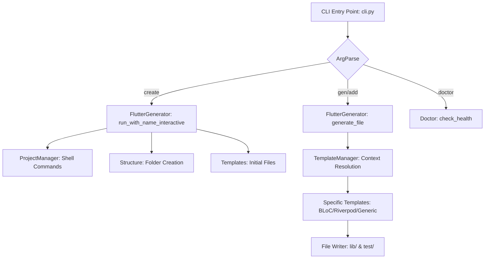

# FPC Technical Documentation v1.0

> **Bilingual Document / Documento Bilíngue**
> [English](#english) | [Português](#português)

---

<a name="english"></a>
# English Version

This project is a high-performance CLI written in Python, designed to automate scaffolding and maintenance for Flutter projects following rigorous architectures (Clean, MVVM, MVC).

## 1. System Architecture

FPC adopts a **Service-Oriented** and **Context-Aware** design. Unlike static template generators, FPC makes runtime decisions based on the current project state (stored in `.fpc.json`).

### Command Flow Diagram


## 2. Core Modules

### 2.1 `TemplateManager` (`template_manager.py`)
The brain of the CLI. It resolves what content should be generated based on:
- **File Type:** (controller, view, service, etc.)
- **State Management:** (Bloc, Riverpod, etc.)
- **Architectural Role:** Whether the file is a `ViewModel` (MVVM) or `Controller` (MVC).

**Technical Highlight: Role-based Naming**
The `TemplateManager` appends suffixes dynamically. If you generate "auth" in MVVM, it transforms into `AuthViewModel`. If in MVC, it becomes `AuthController`. This avoids hardcoding in template files.

### 2.2 `FlutterGenerator` (`generators/generator.py`)
The orchestrator. It manages the UI flow (`rich` prompts) and delegates the physical creation of files and folders.
- **Smart Pathing:** Automatically detects whether to create files in `lib/controllers` or within a `features` structure.
- **Test Mirroring:** Every time a file is generated in `lib/`, it automatically creates a mirror in `test/` with the `_test.dart` suffix.

### 2.3 `Doctor` (`doctor.py`)
Resilient diagnostic module.
- **Environment Checks:** Validates Flutter, Python, and Git versions.
- **Project Integrity:** Verifies if `.fpc.json` is present and if the folder structure matches the declared architecture.

## 3. Template System

Templates are divided into:
- **`generic/`:** Base templates that work without state dependencies.
- **`clean_arch/`:** Specific logic for Data, Domain, and Presentation layers.
- **`bloc/`, `riverpod/`, `mobx/`, etc:** Override default behavior to inject library-specific code.

**Template Function Signature:**
```python
def get_template(class_name: str, base_name: str) -> str:
    # class_name: e.g., UserProfileViewModel (Ready for class definition)
    # base_name: e.g., user_profile (Used for imports and provider names)
```

## 4. Testing Strategy (Stress Test)

`tests/stress_test.py` is an integration suite that simulates real-world CLI usage.

### Hardcore Validations:
1.  **Casing Validation:** Checks if files are `snake_case` and classes are `PascalCase`.
2.  **Import Integrity:** Ensures imports within generated files correctly point to the project name defined in `pubspec.yaml`.
3.  **Architecture Compliance:** If Clean Arch, it validates if `RepositoryImpl` actually contains the `implements` keyword linked to the Interface.
4.  **Mocking:** Uses `unittest.mock` to prevent tests from running real `flutter create` commands, making the suite extremely fast (~0.05s).

## 5. Developer Guide (How to Contribute)

### Adding a New State Template (e.g., Signals)
1.  Create the folder `fpc/templates/signals/`.
2.  Add `controller_template.py` with the function `get_signals_controller_template`.
3.  Register it in `TemplateManager.py` within the `sm_mapping` dictionary.

### Adding a New Rule to Doctor
1.  Open `fpc/doctor.py`.
2.  Add a new method `_check_custom_rule`.
3.  Call it in the main `check_health` method.

### Modifying Folder Structure
1.  Logic resides in `fpc/generators/structure.py`.
2.  FPC centralizes almost everything in `lib/app/` to keep the `lib` root clean.

---

<a name="português"></a>
# Versão em Português

Este projeto é uma CLI de alta performance escrita em Python, projetada para automatizar o scaffolding e a manutenção de projetos Flutter seguindo arquiteturas rigorosas (Clean, MVVM, MVC).

## 1. Arquitetura do Sistema

O FPC adota um design **Service-Oriented** e **Context-Aware**. Diferente de geradores de templates estáticos, o FPC toma decisões em tempo de execução baseadas no estado atual do projeto (armazenado no `.fpc.json`).

### Diagrama de Fluxo de Comando


## 2. Módulos Core

### 2.1 `TemplateManager` (`template_manager.py`)
O cérebro da CLI. Ele resolve qual conteúdo deve ser gerado baseado em:
- **Tipo de Arquivo:** (controller, view, service, etc.)
- **Estado de Gerenciamento:** (Bloc, Riverpod, etc.)
- **Papel Arquitetural:** Se o arquivo é um `ViewModel` (MVVM) ou `Controller` (MVC).

**Destaque Técnico: Role-based Naming**
O `TemplateManager` anexa sufixos dinamicamente. Se você gera um "auth" no MVVM, ele transforma em `AuthViewModel`. Se for no MVC, vira `AuthController`. Isso evita hardcoding nos arquivos de template.

### 2.2 `FlutterGenerator` (`generators/generator.py`)
A orquestradora. Ela gerencia o fluxo de UI (prompts do `rich`) e delega a criação física de arquivos e pastas.
- **Smart Pathing:** Detecta automaticamente se deve criar arquivos em `lib/controllers` ou dentro de uma estrutura de `features`.
- **Test Mirroring:** Toda vez que um arquivo é gerado na `lib/`, ele cria automaticamente um espelho em `test/` com o sufixo `_test.dart`.

### 2.3 `Doctor` (`doctor.py`)
Módulo de diagnóstico resiliente.
- **Environment Checks:** Valida versões de Flutter, Python e Git.
- **Project Integrity:** Verifica se o `.fpc.json` está presente e se a estrutura de pastas condiz com a arquitetura declarada.

## 3. Sistema de Templates

Os templates estão divididos em:
- **`generic/`:** Templates base que funcionam sem dependências de estado.
- **`clean_arch/`:** Lógica específica para camadas de Data, Domain e Presentation.
- **`bloc/`, `riverpod/`, `mobx/`, etc:** Sobrescrevem o comportamento padrão para injetar código específico de cada biblioteca.

**Assinatura de Função de Template:**
```python
def get_template(class_name: str, base_name: str) -> str:
    # class_name: Ex: UserProfileViewModel (Pronto para uso na classe)
    # base_name: Ex: user_profile (Usado para imports e nomes de provedores)
```

## 4. Estratégia de Testes (Stress Test)

O `tests/stress_test.py` é uma suíte de integração que simula o uso real da CLI.

### Validações Hardcore:
1.  **Casing Validation:** Verifica se arquivos são `snake_case` e classes são `PascalCase`.
2.  **Import Integrity:** Garante que os imports dentro dos arquivos gerados apontam corretamente para o nome do projeto definido no `pubspec.yaml`.
3.  **Architecture Compliance:** Se for Clean Arch, ele valida se o `RepositoryImpl` realmente contém a palavra-chave `implements` vinculada à Interface.
4.  **Mocking:** Utiliza `unittest.mock` para evitar que os testes executem comandos `flutter create` reais, tornando a suíte extremamente rápida (~0.05s).

## 5. Guia do Desenvolvedor (Como Contribuir)

### Adicionando um Novo Template de Estado (Ex: Signals)
1.  Crie a pasta `fpc/templates/signals/`.
2.  Adicione `controller_template.py` com a função `get_signals_controller_template`.
3.  Registre no `TemplateManager.py` dentro do dicionário `sm_mapping`.

### Adicionando uma Nova Regra ao Doctor
1.  Abra `fpc/doctor.py`.
2.  Adicione um novo método `_check_custom_rule`.
3.  Chame-o no método principal `check_health`.

### Modificando a Estrutura de Pastas
1.  A lógica reside em `fpc/generators/structure.py`.
2.  O FPC centraliza quase tudo em `lib/app/` para manter a raiz da `lib` limpa.

---

> **Final Note:** FPC was built to be extensible. The secret to its robustness lies in the clear separation between **User Intent** (CLI), **Decision Logic** (Generator), and **Content Factory** (TemplateManager).
